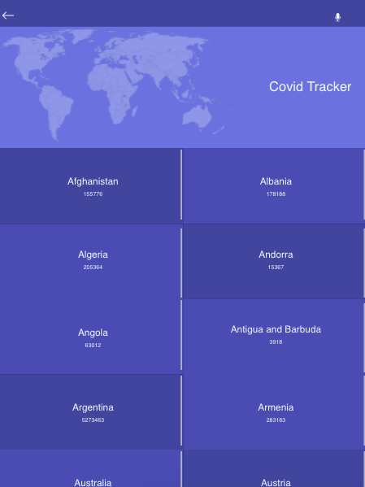
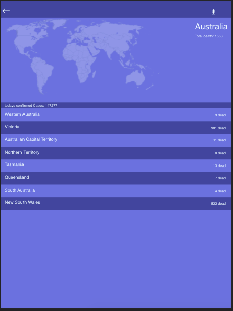

# Covid Tracker




the covid tracker is an App that allows you to keep track of the covid-19 Deaths by country and by date Around the world. You can check information by contry and some countries have information for city.

## Getting Started

In the project directory, you can run:

```bash
$ npm install
$ npm start
```

Runs the app in the development mode.\
Open [http://localhost:3000](http://localhost:3000) to view it in the browser.


```bash
$ npm test
```

Launches the test runner in the interactive watch mode.\
See the section about [running tests](https://facebook.github.io/create-react-app/docs/running-tests) for more information.


```bash
$ npm build
```

Builds the app for production to the `build` folder.\
It correctly bundles React in production mode and optimizes the build for the best performance.

The build is minified and the filenames include the hashes.\
Your app is ready to be deployed!

See the section about [deployment](https://facebook.github.io/create-react-app/docs/deployment) for more information.

## Demo

- Open [live demo](https://nchorage-03766.herokuapp.com/) 

## Vidoe

- More information [Watch](https://www.loom.com/share/43bb8fbf942c4655b5d1b6fc776af746)

## Made with

- Javascript
- CSS3
- HTML5
- react
- rudex
- Jest testing framework

## Acknowledgment

- Original design by: [Nelson Sakwa on Behance](https://www.behance.net/sakwadesignstudio)


## Author


👤 **Amal Hersi**

- GitHub: [Amal Hersi](https://github.com/Amalcxc)
- Twitter: [@Amalcx4](https://twitter.com/home?lang=en)
- LinkedIn: [Amal Hersi](https://www.linkedin.com/in/amal-hersi-a29583205/)


## 🤝 Contributing

Contributions, issues and feature requests are welcome!

Feel free to check the [issues page](issues/).

## Show your support

Give a ⭐️ if you like this project! ⭐️

## Acknowledgments

- Hat tip to anyone whose code was used
- Inspiration
- etc

## 📝 License

This project is [MIT](lic.url) licensed.
